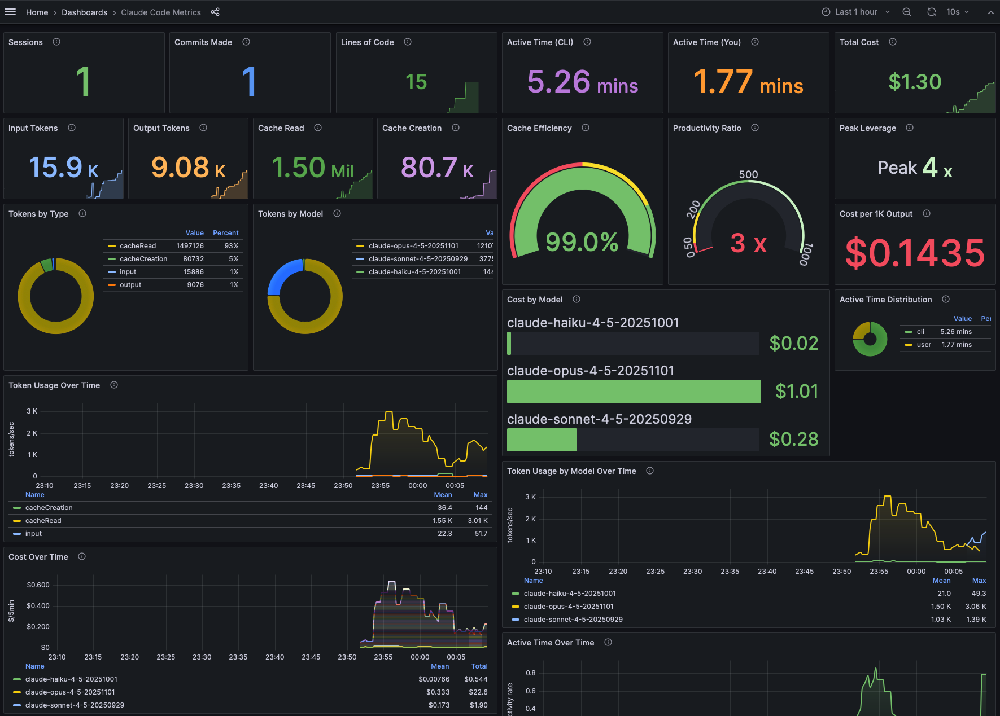

# Claude Code Grafana Observability Stack

A complete observability stack for monitoring Claude Code usage, costs, and performance using OpenTelemetry, Prometheus, Loki, and Grafana.



## Quick Start

### 1. Start the Stack

```bash
make up
```

This starts:
- **OpenTelemetry Collector** (ports 4317/4318) - receives telemetry from Claude Code
- **Prometheus** (port 9090) - stores metrics
- **Loki** (port 3100) - stores logs/events
- **Grafana** (port 3000) - visualizes everything

### 2. Configure Claude Code

**Option A: Use the setup script (each terminal session)**

```bash
source setup-env.sh
claude
```

**Option B: Create a convenience alias (recommended)**

Add this to your `~/.zshrc` or `~/.bashrc`:

```bash
alias claude-telemetry='source /path/to/claude_grafana/setup-env.sh && claude'
```

Then use:
- `claude` - Normal Claude Code (no telemetry)
- `claude-telemetry` - Claude Code with telemetry enabled

This gives you control over when telemetry is collected without the overhead of permanent environment variables.

**Option C: Set environment variables manually**

```bash
export CLAUDE_CODE_ENABLE_TELEMETRY=1
export OTEL_METRICS_EXPORTER=otlp
export OTEL_LOGS_EXPORTER=otlp
export OTEL_EXPORTER_OTLP_PROTOCOL=grpc
export OTEL_EXPORTER_OTLP_ENDPOINT=http://localhost:4317
claude
```

### 3. View Dashboards

Open [http://localhost:3000](http://localhost:3000) (login: admin/admin)

### 4. Shutting Down

When you're done, exit Claude normally. The Docker containers will continue running in the background. To stop them:

```bash
make down
```

This command can be run from any terminal as long as you're in the project root directory. Use `make clean` instead if you want to remove all collected data.

## Dashboard Features

The pre-configured dashboard includes:

### Overview
- Total sessions, cost, tokens, lines changed, commits, PRs
- Active time tracking (CLI and user time)
- Productivity ratio and leverage metrics

### Cost & Token Usage
- Cost by model over time
- Token usage by type (input/output/cache read/creation)
- Token distribution by model
- Cache efficiency gauge (98%+ is typical)
- Cost per 1K output tokens

### Code Activity
- Lines of code added/removed
- Git commits and pull requests

### Time & Productivity
- Active time distribution
- CLI vs user time comparison
- Peak productivity leverage

### Event Logs
- Real-time Claude Code event logs (via Loki)

## Commands

```bash
make up              # Start all services
make down            # Stop all services
make restart         # Restart all services
make status          # Show service status
make logs            # View all logs
make logs-collector  # View OTel Collector logs
make clean           # Remove containers and volumes
make validate        # Validate configuration files
make setup           # Show setup instructions
```

## Architecture

```
Claude Code  ──OTLP──▶  OTel Collector  ──▶  Prometheus (metrics)
                              │
                              └──────────▶  Loki (logs/events)
                                                  │
                              Grafana  ◀──────────┘
```

## Available Metrics

| Metric | Description |
|--------|-------------|
| `claude_code_session_count_total` | CLI sessions started |
| `claude_code_cost_usage_total` | Cost in USD by model |
| `claude_code_token_usage_total` | Tokens by type (input/output/cache) |
| `claude_code_lines_of_code_count_total` | Lines added/removed |
| `claude_code_commit_count_total` | Git commits |
| `claude_code_pull_request_count_total` | Pull requests created |
| `claude_code_code_edit_tool_decision_total` | Tool accept/reject decisions |

## Configuration Options

### Privacy Controls

```bash
# Enable user prompt logging (disabled by default)
export OTEL_LOG_USER_PROMPTS=1
```

### Cardinality Control

```bash
export OTEL_METRICS_INCLUDE_SESSION_ID=true   # default: true
export OTEL_METRICS_INCLUDE_VERSION=false     # default: false
export OTEL_METRICS_INCLUDE_ACCOUNT_UUID=true # default: true
```

### Team Tracking

```bash
export OTEL_RESOURCE_ATTRIBUTES="department=engineering,team.id=platform"
```

## Customization

### Modify Export Intervals

Edit `setup-env.sh`:

```bash
export OTEL_METRIC_EXPORT_INTERVAL=60000  # 60 seconds (production)
export OTEL_LOGS_EXPORT_INTERVAL=5000     # 5 seconds
```

### Add Custom Dashboards

Place JSON dashboard files in `config/grafana/dashboards/`

### Modify Collector Pipeline

Edit `config/otel-collector-config.yaml`

## Troubleshooting

### No metrics appearing?

1. Check collector is running: `make status`
2. View collector logs: `make logs-collector`
3. Verify environment: `echo $CLAUDE_CODE_ENABLE_TELEMETRY`
4. Try console exporter first: `export OTEL_METRICS_EXPORTER=console`

### Metrics being dropped with "invalid temporality" error?

Claude Code sends **delta** temporality metrics, but Prometheus requires **cumulative**. The OTel Collector config includes a `deltatocumulative` processor to handle this conversion. If you see errors like:

```
Exporting failed. Dropping data. error: invalid temporality and type combination
```

Ensure your collector config includes:
1. The `deltatocumulative` processor defined in the processors section
2. The processor added to the metrics pipeline: `processors: [memory_limiter, deltatocumulative, batch]`
3. OTel Collector version 0.111.0+ (earlier versions don't include this processor)

### Grafana shows "No data"?

1. Ensure you've used Claude Code after enabling telemetry
2. Check time range in Grafana (top right)
3. Wait for export interval to elapse (default: 60s for metrics)

## References

- [Claude Code Monitoring Docs](https://docs.anthropic.com/en/docs/claude-code/monitoring)
- [OpenTelemetry Documentation](https://opentelemetry.io/docs/)
- [Grafana Documentation](https://grafana.com/docs/)

## License

MIT
